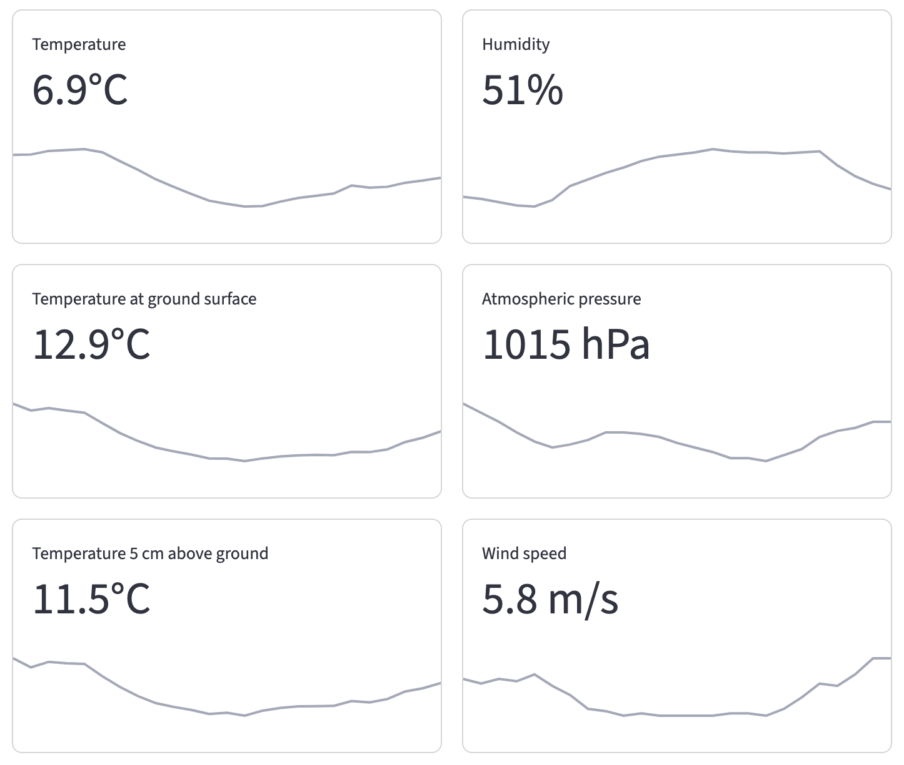

# Meteo Dashboard

	

API backend for storing data and web dashboard for displaying meteorological measurements in number and graphical formats.

## Description

Data is sent from Vaisala meteorological station and collected using /send endpoint which accepts a dict, containing measurements and set password. Data is stored in a PostgreSQL database. Endpoints with GET methods are used together with SQL queries for getting latest measurements, average values or data in set range.

Streamlit frontend is used for displaying measurements in metrics with sparklines and a dataframe. Altair charts are used for displaying a line chart with set parameters in chosen range.

## Installing and running

Use `pip install -r requirements.txt` to install required packages for both API and dashboard.

PostgreSQL database is required with a table named `meteo_data`. Create proper columns using database model stored in `MeteoDataModel` class. Using an index is suggested for displaying latest data - create it using `CREATE INDEX meteo_data_datetime_idx ON <schema_name>.meteo_data(datetime DESC)` SQL query.

Set environment variables required by FastAPI:
- `METEO_PASSWORD` for authenticating computer sending measurements to /send endpoint, exact same password should be set on computer,
- `METEO_DATABASE_URL` for URL address to PostgreSQL database, should be in format `postgresql://<username>:<password>@<address>:<port>/<database_name>?options=-c search_path=<schema_name>`, options part is optional if default PostgreSQL schema is used,
- `METEO_PRESSURE_CORRECTION` for float value used to calculate pressure reduced to sea level, e.g. `11.4`.

Set `METEO_API_URL` environment variable for Streamlit dashboard, containing an URL address to API for fetching measurements.

Use `uvicorn main:app --host <ip_address> --port <port> --app-dir ./api/` command to start Uvicorn server with FastAPI.

Use `streamlit run dashboard/main.py` command to start Streamlit dashboard.

## Demo versions

Both [API](https://meteo-dashboard-debug-api.onrender.com) and [dashboard](https://meteo-dashboard-debug-frontend-olpp.onrender.com) are hosted on Render service.